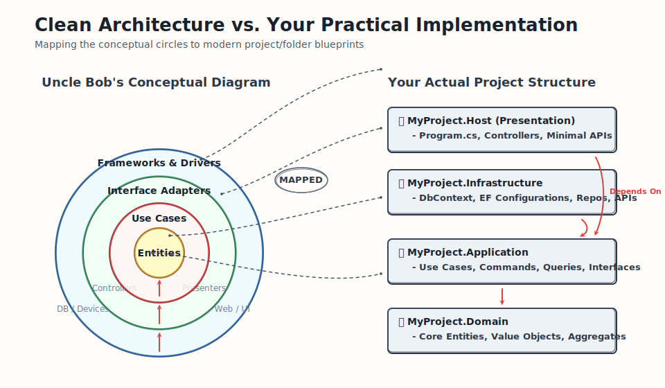

## Clean Architecture

Clean Architecture isolates your core business logic by forcing all system dependencies to point inward, making your application completely independent of databases, UIs, and external frameworks.