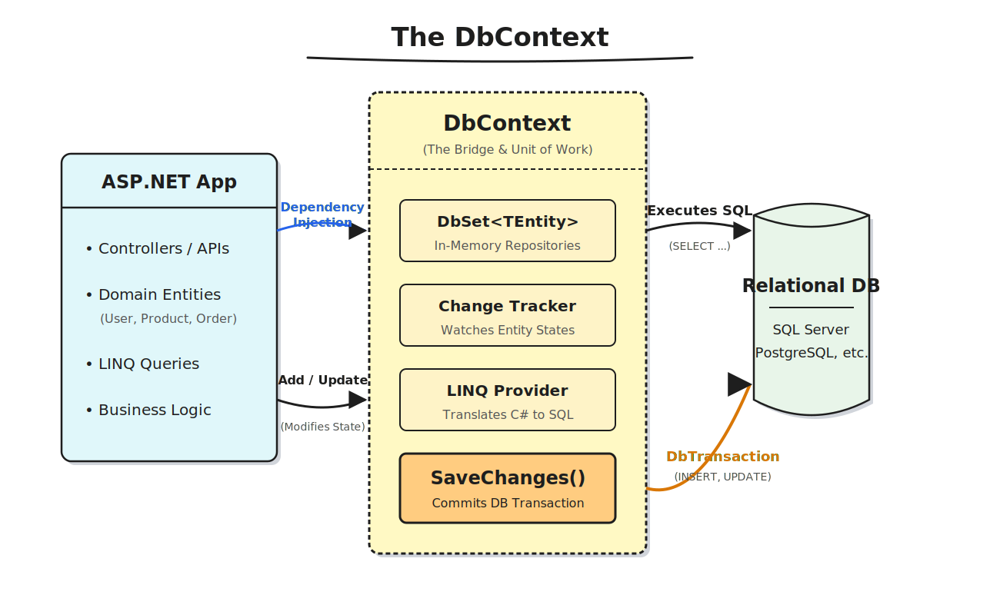



### How `DbContext` Works: 

**1. Dependency Injection (The Setup)**
* Your ASP.NET Core app (via a Controller or Service) needs data.
* The DI container injects a newly scoped instance of `DbContext`.

**2. DbSet & LINQ Provider (The Read)**
* You write a query in C#: `_context.Users.Where(u => u.IsActive).ToList();`
* The **LINQ Provider** intercepts this, translates the C# Expression Tree into raw SQL (e.g., `SELECT * FROM Users WHERE IsActive = 1`), and sends it to the database.
* The database returns rows, and EF Core materializes them back into C# objects.

**3. Change Tracker (The Watcher)**
* Once those objects are in memory, the **Change Tracker** attaches to them.
* If you modify a property (`user.Status = "Premium";`), the tracker compares the new state against its original snapshot and flags the entity as `Modified`.
* *Pro-tip:* It tracks *exactly* which properties changed, so it doesn't waste resources updating columns that stayed the same.

**4. SaveChanges() (The Unit of Work)**
* You call `_context.SaveChanges();`
* The `DbContext` checks the Change Tracker for all `Added`, `Modified`, and `Deleted` entities.
* It generates the exact `INSERT`, `UPDATE`, and `DELETE` SQL statements needed and wraps them all in a **single database transaction**.
* If everything succeeds, the transaction is committed. If the database rejects even one change, the entire transaction rolls back to prevent corrupted or partial data.