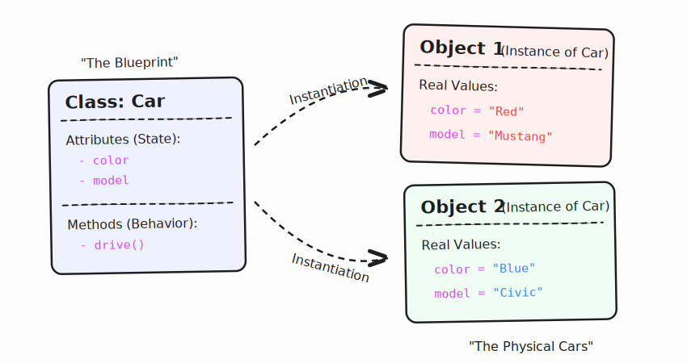

# Why OOP?

 - **_Modularity & Organization:_** Keep code neat in small, tidy parts. It's like having different boxes for toys, clothes, and books. It makes things easier to find!

- **_Reusability:_** Use good parts of your code again in new places. It's like using the same recipe to bake multiple cakes. Saves you lots of time!

-  **_Maintainability:_** Fixing problems is easy. If something goes wrong, you only have to fix that one part, and everything else will keep working fine.

 - **_Scalability:_** Make your app grow bigger and bigger. Think of adding more floors to a tall building as you need more space.

 - **_Security & Encapsulation:_** Keep important information safe. It's like having strong locks and keys, so only the right people can see secret things.
 
 - **_Collaboration:_** Many friends can build the app together. Everyone works on their own part at the same time, without getting in each other's way.

**Class and Object are the core building blocks of Object-Oriented Programming (OOP).**

`Class`

A class is a blueprint or template that defines.

- Properties (variables / attributes)
- Behaviors (methods / functions)

 **_A class does not occupy memory until an object is created._**

 `Object`

An object is a real instance of a class. 
It:
- Occupies memory
- Has actual values
- Can call class methods

