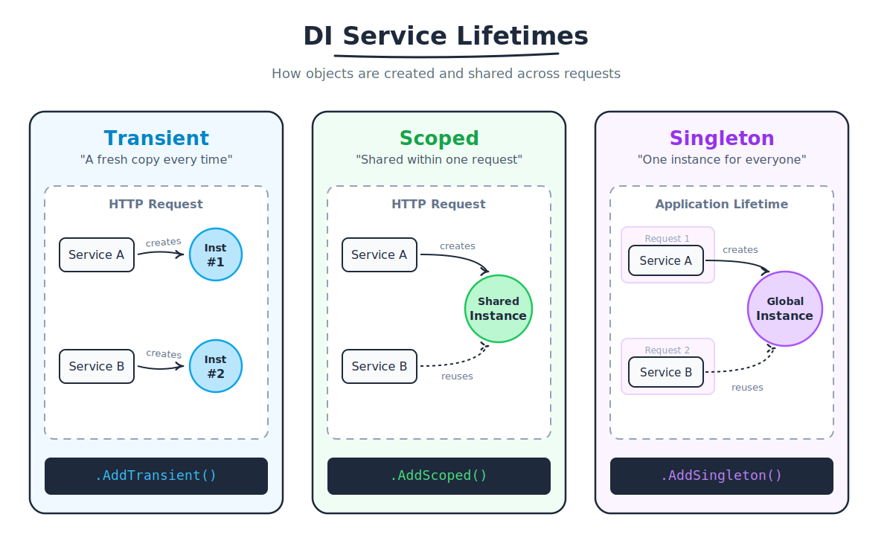

### 1. Transient: "Fresh every time"

   A new instance is created every single time it is requested. If two different components in the same web request ask for a transient service, they will each get their own separate copy.

Best for: Lightweight, stateless services.

Registration: `builder.Services.AddTransient<IMyService, MyService>();`

### 2. Scoped: "Once per request"

   A new instance is created once per HTTP request. Every component working on that specific web request will share the exact same instance. Once the request is finished (the page loads or the API returns), the object is destroyed.

Best for: Database contexts (DbContext), user session info, or services that need to maintain state during a single request.

Registration: `builder.Services.AddScoped<IMyService, MyService>();`

### 3. Singleton: "One for everyone"
   Only one instance is created for the entire lifetime of the application. Every user and every request shares that same single object until the web server restarts.

Best for: Caching services, configuration settings, or shared resources that don't change.

Registration: `builder.Services.AddSingleton<IMyService, MyService>();`

