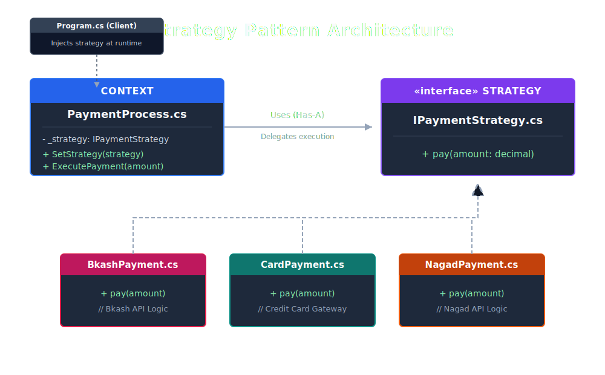

## Strategy pattern

`Strategy is a behavioral design pattern that lets you define a
family of algorithms, put each of them into a separate class,
and make their objects interchangeable.`

`IPaymentStrategy` is the contract. It defines one method — `Pay(decimal amount)` — that all payment methods must implement. Neither the client nor the context knows (or cares) what happens inside.
`BkashPayment`, `CardPayment`, and `NagadPayment` are the concrete strategies. Each implements the interface with its own logic.

`PaymentProcess` is the context. It holds a reference to whichever `IPaymentStrategy` was injected at runtime. When you call `ProcessPayment()`, it just delegates to `_strategy.Pay(amount)`  it never asks which one?

The key benefit is the `Open/Closed Principle` in action: adding a new payment method (say, `SslcommerzPayment`) requires zero changes to `PaymentProcess` or `Program.cs`  you just write a new class that implements the interface.

